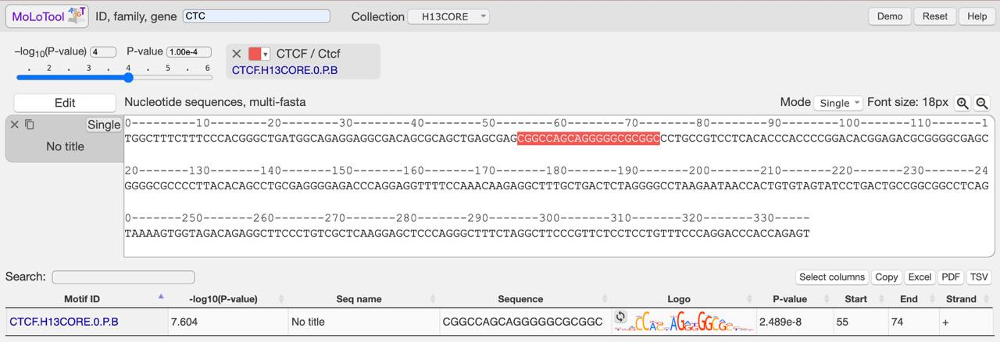

## Workflow

As an example two ATAC peaks in the loop anchor with CTCF motif were analysed. We expect to observe + strand orientation in the first coordinate (peak_32285) and - strand in the second (peak_32291) because convergent state is more common for CTCF in loop anchors


1. **Get bed file with peak coords**

```
grep "S2A_peak_32285" /data/ddpanchenko/main_dom/hepatocytes/ATACseq/data/S2A_peaks_merged.narrowPeak > data/S2A_peak_32285.narrowPeak
```

```
grep "S2A_peak_32291" /data/ddpanchenko/main_dom/hepatocytes/ATACseq/data/S2A_peaks_merged.narrowPeak > data/S2A_peak_32291.narrowPeak
```

**Output**

```
5       142713214       142713552       S2A_peak_32285  5.91716
```

```
5       142866719       142867410       S2A_peak_32291  4.73934
```

2. **Get fasta file with seq for SARUS**

```
bedtools getfasta -fi /data/ddpanchenko/main_dom/genomes/hg38/hg38_nochr.fa -bed data/S2A_peak_32285.narrowPeak -fo data/S2A_peak_32285.fasta -name
```

```
bedtools getfasta -fi /data/ddpanchenko/main_dom/genomes/hg38/hg38_nochr.fa -bed data/S2A_peak_32291.narrowPeak -fo data/S2A_peak_32291.fasta -name
```

**Output**

``>S2A_peak_32285::5:142713214-142713552 TGGCTTTCTTTCCCACGGGCTGATGGCAGAGGAGGCGACAGCGCAGCTGAGCGAGCGGCCAGCAGGGGGCGCGGCCCTGCCGTCCTCACACCCACCCCGGACACGGAGACGCGGGGCGAGCGGGGCGCCCCTTACACAGCCTGCGAGGGGAGACCCAGGAGGTTTTCCAAACAAGAGGCTTTGCTGACTCTAGGGGCCTAAGAATAACCACTGTGTAGTATCCTGACTGCCGGCGGCCTCAGTAAAAGTGGTAGACAGAGGCTTCCCTGTCGCTCAAGGAGCTCCCAGGGCTTTCTAGGCTTCCCGTTCTCCTCCTGTTTCCCAGGACCCACCAGAGT``

``>S2A_peak_32291::5:142866719-142867410``
``GATGGCCTCATTTAGGAAATGCTGTTTTAGGGAAATGGCCTCAGGAAAAGCACGCAGATGTATGATCAGAATGCATGTTATGTAACGTACCGTGGCTGATGTGGTCGGTGGGCACATCATCCGCCTGGGGGAGATAAGAGGTTTTCTGAATCTGCTCCAGCCAGATCTGAAAGAATGTGAGAGACACTGTGGTGGTGACTTCATCCCTATACCCCTCCCACTCCATGTCTCAGGCTTGACTTGCTGTATGAGAGCACAGGCCCTCCGAATGTGTTAGAGCACTTCTTCCAATGTGGAAGCCAGGGCCCCTCTCTCAGTTGCTGAGTGTCCACTGGACATTTCTAGGTGGTTATTTGTTCCTCAGTGGGACAGGATCTGTTCTCAGCACTGCCTTTAAGGCTGGCCCTGTCATTTCTCCTTGAGTCTTAGCTGTTGTTTAAATTAGCTGCTTGGTCAAGGTGTTCTCTGATATAGTTGATTGCCACCTAGTGGCCACAGGTAAGACCGTGTGTCACGGAAACGAGAAAAATGCTATGGAGAATTTTGTTTCATTCTAAGATTTgcacagggtgtgtgtgtgtgtgtgtgtgtgtgtgtgtgtgtgtgtgttttgtttgtttttgctagtACAATGCCAGGAGTCTGGGCTGCAGAATGGTATTTACAAGGGACTGTAACTTGCTTTTCTTAT``

3. **SARUS**

```
java -jar /home/ddpanchenko/Tools/sarus/sarus-latest.jar data/S2A_peak_32285.fasta data/ctcf.motif besthit > sarus/SARUS_ctcf_motifs.txt
```

```
java -jar /home/ddpanchenko/Tools/sarus/sarus-latest.jar data/S2A_peak_32291.fasta data/ctcf.motif besthit > sarus/SARUS_ctcf_motifs_S2A_peak_32291.txt
```

**Output**

```
>S2A_peak_32285::5:142713214-142713552
11.910000000000002      55      -
```

```
>S2A_peak_32291::5:142866719-142867410 
12.611  475     +
```

3.1. Convert to homer format

in my jupyter notebook

**Output**

```
PositionID      Offset  Sequence        Motif Name      Strand  MotifScore 
S2A_peak_32285  55              CTCF(Zf)/CD4+-CTCF-ChIP-Seq(Barski_et_al.)/Homer        -       11.910000000000002
```

```
PositionID      Offset  Sequence        Motif Name      Strand  MotifScore
S2A_peak_32291  475             CTCF(Zf)/CD4+-CTCF-ChIP-Seq(Barski_et_al.)/Homer        +       12.611
```

4. **HOMER**

```
findMotifsGenome.pl data/S2A_peak_32285.narrowPeak /data/ddpanchenko/main_dom/genomes/hg38/hg38_nochr.fa homer/ -size given  -find data/ctcf.motif > homer/ctcf_motifs.txt
```

```
findMotifsGenome.pl data/S2A_peak_32291.narrowPeak /data/ddpanchenko/main_dom/genomes/hg38/hg38_nochr.fa homer/ -size given  -find data/ctcf.motif > homer/ctcf_motifs_S2A_peak_32291.txt
```

**Output**

```
PositionID      Offset  Sequence        Motif Name      Strand  MotifScore 
S2A_peak_32285  74      CGGCCAGCAGGGGGCGCGGC    CTCF(Zf)/CD4+-CTCF-ChIP-Seq(Barski_et_al.)/Homer        -       13.679485
```

```
PositionID      Offset  Sequence        Motif Name      Strand  MotifScore 
S2A_peak_32291  475     TGATTGCCACCTAGTGGCCA    CTCF(Zf)/CD4+-CTCF-ChIP-Seq(Barski_et_al.)/Homer        +       15.052933
```

5. **Get seq from data/*.fasta and go to https://molotool.autosome.org/**




